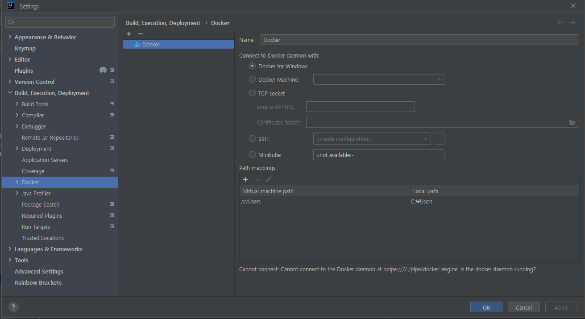

# LoaRing - 로아링 프로젝트

---

**[메인페이지로 이동](README.md)**

## 도커 가입 및 도커-허브 윈도우 다운로드

- [도커계정가입](https://www.lainyzine.com/ko/article/how-to-create-a-docker-hub-account/)
    - 리커버리코드 및 개인토큰 발급은 하지 않고 가입만 진행

- [도커허브 다운로드 및 설치](https://yooloo.tistory.com/38)

## Intellij Docker 셋팅

1. Docker-hub.exe 파일 실행
2. Intellij 셋팅 Docker 연결 확인

